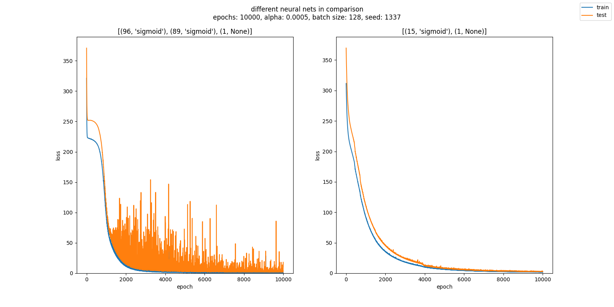
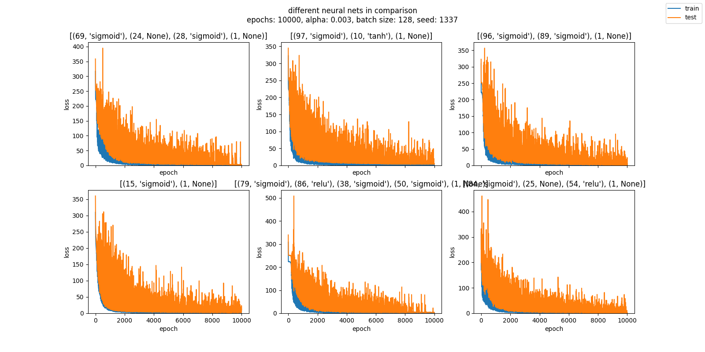

### Data
The data is from [https://archive.ics.uci.edu/dataset/243/yacht+hydrodynamics](https://archive.ics.uci.edu/dataset/243/yacht+hydrodynamics).

Their information on the dataset is this:
```
Dataset Information
Prediction of residuary resistance of sailing yachts at the initial design
stage is of a great value for evaluating the ship's performance and for
estimating the required propulsive power. Essential inputs include the basic
hull dimensions and the boat velocity. 
The Delft data set comprises 308 full-scale experiments, which were performed
at the Delft Ship Hydromechanics Laboratory for that purpose. 
These experiments include 22 different hull forms, derived from a parent form
closely related to the 'Standfast 43' designed by Frans Maas.
Additional Variable Information
Variations concern hull geometry coefficients and the Froude number:

1. Longitudinal position of the center of buoyancy, adimensional.
2. Prismatic coefficient, adimensional.
3. Length-displacement ratio, adimensional.
4. Beam-draught ratio, adimensional.
5. Length-beam ratio, adimensional.
6. Froude number, adimensional.

The measured variable is the residuary resistance per unit weight of
displacement:
7. Residuary resistance per unit weight of displacement, adimensional.
```

The data used is this: [example_data/yacht.csv](example_data/yacht.csv "example_data/yacht.csv").

It follows that this is a regression problem, so an output layer with one node and no activation function is appropriate, as are 6 input nodes for the 6 numeric features. Feature scaling is heavily implied.

### Clarification
A neural net hidden setup like this
```python
[(69, 'relu'), (92, None), (71, 'tanh'), (1, None)]
```
means a sequential neural network with an implied input layer with 6 input nodes and no activation, a hidden layer with 69 nodes and a ReLU activation, then another hidden layer with 92 nodes and no activation, then another hidden layer with 71 nodes and a Tanh activation, then the output layer with 1 node and no activation. This output layer will be the default throughout the project.

### Procedure
I create the following random set neural networks with the fixed last layer of (1, None) and let them run for 1000 epochs with an alpha of 0.003.
```python
# rnd_model_creation_seed: 308778
[0]: [(30, 'relu'), (43, 'sigmoid'), (9, 'relu'), (1, None)]
[1]: [(51, 'sigmoid'), (86, None), (81, None), (87, None), (1, None)]
[2]: [(97, 'tanh'), (1, None)]
[3]: [(65, 'relu'), (1, None)]
[4]: [(69, 'relu'), (92, 'tanh'), (71, 'sigmoid'), (1, None)]
[5]: [(4, None), (1, None)]
[6]: [(63, 'tanh'), (49, 'relu'), (10, 'relu'), (86, 'sigmoid'), (1, None)]
[7]: [(13, None), (54, None), (40, 'relu'), (20, 'tanh'), (1, None)]
[8]: [(95, 'tanh'), (96, 'relu'), (40, 'relu'), (64, None), (1, None)]
[9]: [(67, 'tanh'), (1, None)]
[10]: [(23, None), (1, None)]
[11]: [(79, None), (51, 'sigmoid'), (96, None), (1, None)]
[12]: [(90, 'relu'), (4, 'relu'), (82, 'tanh'), (1, None)]
[13]: [(56, None), (60, 'tanh'), (100, 'sigmoid'), (1, None)]
[14]: [(31, 'tanh'), (1, None)]
[15]: [(37, 'sigmoid'), (55, None), (20, 'tanh'), (1, None)]
[16]: [(47, None), (86, 'tanh'), (1, None)]
[17]: [(44, 'sigmoid'), (32, 'sigmoid'), (5, 'tanh'), (69, 'tanh'), (1, None)]
[18]: [(41, None), (96, 'tanh'), (17, 'tanh'), (1, 'relu'), (1, None)]
[19]: [(60, 'sigmoid'), (81, 'sigmoid'), (16, 'tanh'), (1, None)]
[20]: [(47, None), (8, 'tanh'), (75, 'relu'), (30, 'relu'), (1, None)]
[21]: [(64, 'sigmoid'), (30, 'tanh'), (75, None), (26, 'tanh'), (1, None)]
[22]: [(14, 'relu'), (71, 'relu'), (31, 'relu'), (35, 'tanh'), (1, None)]
[23]: [(29, 'tanh'), (48, 'sigmoid'), (1, None)]
[24]: [(25, 'sigmoid'), (45, None), (37, 'relu'), (1, None)]
[25]: [(56, 'sigmoid'), (9, 'tanh'), (50, 'sigmoid'), (13, 'sigmoid'), (1, None)]
[26]: [(1, 'relu'), (9, None), (1, None)]
[27]: [(42, 'tanh'), (59, 'sigmoid'), (1, None)]
[28]: [(68, 'relu'), (1, None)]
[29]: [(5, 'sigmoid'), (15, 'tanh'), (97, None), (1, None)]
[30]: [(87, 'sigmoid'), (1, None)]
[31]: [(39, 'relu'), (1, None)]
[32]: [(68, 'sigmoid'), (13, 'tanh'), (85, 'tanh'), (38, None), (1, None)]
[33]: [(36, 'sigmoid'), (42, None), (84, 'relu'), (1, None)]
[34]: [(85, None), (69, 'sigmoid'), (27, None), (30, None), (1, None)]
[35]: [(19, None), (9, 'relu'), (79, 'relu'), (1, None)]
```
The results can be found [here](#random-36), but nothing catched my eye.

I then create a batch of 25 other random neural networks and let them run with the same alpha but 10000 epochs instead:
```python
# rnd_model_creation_seed: 469267
[0]: [(94, 'tanh'), (1, None)]
[1]: [(69, 'sigmoid'), (24, None), (28, 'sigmoid'), (1, None)]
[2]: [(10, 'tanh'), (79, 'sigmoid'), (1, None)]
[3]: [(68, 'relu'), (77, None), (1, None)]
[4]: [(57, None), (37, 'relu'), (1, None)]
[5]: [(82, 'relu'), (89, 'tanh'), (41, 'relu'), (51, 'tanh'), (1, None)]
[6]: [(20, 'tanh'), (97, 'sigmoid'), (40, None), (1, None)]
[7]: [(29, 'tanh'), (61, 'sigmoid'), (73, 'relu'), (1, None)]
[8]: [(38, None), (99, 'relu'), (40, 'tanh'), (17, None), (1, None)]
[9]: [(32, None), (1, None)]
[10]: [(97, 'sigmoid'), (10, 'tanh'), (1, None)]
[11]: [(47, 'relu'), (1, None)]
[12]: [(6, None), (18, 'tanh'), (59, None), (32, 'tanh'), (1, None)]
[13]: [(51, 'tanh'), (17, 'sigmoid'), (1, None)]
[14]: [(96, 'sigmoid'), (89, 'sigmoid'), (1, None)]
[15]: [(94, 'sigmoid'), (65, None), (92, 'relu'), (88, None), (1, None)]
[16]: [(69, 'tanh'), (17, 'tanh'), (1, None)]
[17]: [(15, 'sigmoid'), (1, None)]
[18]: [(100, 'tanh'), (27, 'sigmoid'), (7, None), (1, None)]
[19]: [(79, 'sigmoid'), (86, 'relu'), (38, 'sigmoid'), (50, 'sigmoid'), (1, None)]
[20]: [(45, None), (56, None), (13, 'relu'), (44, 'sigmoid'), (1, None)]
[21]: [(36, 'tanh'), (1, None)]
[22]: [(84, 'sigmoid'), (25, None), (54, 'relu'), (1, None)]
[23]: [(12, 'tanh'), (79, 'tanh'), (73, None), (97, 'tanh'), (1, None)]
[24]: [(57, 'relu'), (1, None)]
```


Results in pdf: [example_data/25_10k_epochs_1.pdf](example_data/25_10k_epochs_1.pdf "example_data/25_10k_epochs_1.pdf")

I extract 6 well performing neural nets for further analysis and let them run with 10000 epochs on different alphas:
```python
[3e-4, 3e-3, 3e-2, 3e-1]
```

```python
[1]: [(69, 'sigmoid'), (24, None), (28, 'sigmoid'), (1, None)]
[10]: [(97, 'sigmoid'), (10, 'tanh'), (1, None)]
[14]: [(96, 'sigmoid'), (89, 'sigmoid'), (1, None)]
[17]: [(15, 'sigmoid'), (1, None)]
[19]: [(79, 'sigmoid'), (86, 'relu'), (38, 'sigmoid'), (50, 'sigmoid'), (1, None)]
[22]: [(84, 'sigmoid'), (25, None), (54, 'relu'), (1, None)]
```
The results for alpha = 3e-4 gave 2 very promising results, plot 3 and 4 (in z-order) of which plot 4 looked the most clean and steady.

Results in pdf: [example_data/6_excerpt_3e-4.pdf](example_data/6_excerpt_3e-4.pdf "example_data/6_excerpt_3e-4.pdf")
The result is so good, in fact, that i could abort the tests and pick this composition ([(15, 'sigmoid'), (1, None)], SGD, MSE, alpha = 3e-4, epochs= 10000) on the spot, but decide to go on for completeness.

Those additional tests didn't produce any interesting results and can be accessed further down [here](#excerpts-of-6).

Next, i pick the best two networks and run them on alphas closer to the last best of 3e-4:
```python
[9e-4, 8e-4, 7e-4, 6e-4, 5e-4, 4e-4, 3e-4, 2e-4, 1e-4]
```
I choose the result of alpha = 5e-4 as a good compromise between needed epochs and smoothness of the curve, results with other alphas can be found [here](#excerpts-of-2).

```python
alpha: 0.0005
[0]: [(96, 'sigmoid'), (89, 'sigmoid'), (1, None)]
[1]: [(15, 'sigmoid'), (1, None)]
```

Results in pdf: [example_data/2_excerpt_5e-4.pdf](example_data/2_excerpt_5e-4.pdf "example_data/2_excerpt_5e-4.pdf")

From these two results, i choose the neural network on the right with 6 nodes on the input layer, 1 hidden layer with 15 hidden nodes and sigmoid activation and 1 output layer with 1 node and no activation function, optimizer is SGD, loss is MSE.

I plot this nn with more epochs as an overview.
```python
alpha: 0.0005
[0]: [(15, 'sigmoid'), (1, None)]
```

Results in pdf: [example_data/final_5e-4_50k_epochs.pdf](example_data/final_5e-4_50k_epochs.pdf "example_data/final_5e-4_50k_epochs.pdf")

The neural net shows no signs of overfitting, so i further test this by plotting the same setup with different seeds, for that i choose 20k epochs.

```python
[0] - alpha: 0.0005, seed: 647760
[1] - alpha: 0.0005, seed: 970494
[2] - alpha: 0.0005, seed: 559169
[3] - alpha: 0.0005, seed: 744363
[4] - alpha: 0.0005, seed: 383619
[5] - alpha: 0.0005, seed: 598714
```

Results in pdf: [example_data/final_5e-4_20k_epochs_different_seeds.pdf](example_data/final_5e-4_20k_epochs_different_seeds.pdf "example_data/final_5e-4_20k_epochs_different_seeds.pdf")

(Despite the supertitle of the plot implying one seed for all plots, it really only shows the first seed, which can be seen on the different maximum y values on plot one and two, for example. The listing above shows the seed by plot, numbered in z-order.)

As none of the plots show any signs of overfitting as well, i choose this model finally.

This is the end of this project, the following plots are the dropped plots listed for completeness and traceability.

All plots are present in .png and .pdf file format for further use as linked in this document.

A printout of this file in .pdf file format can be found [here](yacht_hydrodynamics_project.pdf), the code is [here](yacht_hydrodynamics_project.py) with all model fitting and collection deactivated (because of somewhat heavy cpu load) like this:
```python
# generation of 25 neural nets
if False:
    temp_seed = seed
    set_seeds(469267)
    setups = rnd_setups(25, fixed_output= (1, None), ignore_seed=False)
    models = bulk_fit(
        X= X,
        y= y,
        node_setups= setups,
        learning_rate= 0.003,
        epochs= 10000,
        batch_size= 128)
```
One needs to only change the first line to
```python
if True:
```
to run that segment of code.

---
### other tests
#### random 36:
<!-- [random 36 nns](rnd_36_1.pdf) -->

Results in pdf: [example_data/rnd_36_1.pdf](example_data/rnd_36_1.pdf "example_data/rnd_36_1.pdf")

---
#### excerpts of 6:

Results in pdf: [example_data/6_excerpt_3e-3.pdf](example_data/6_excerpt_3e-3.pdf "example_data/6_excerpt_3e-3.pdf")


Results in pdf: [6_excerpt_3e-2.pdf](example_data/6_excerpt_3e-2.pdf "example_data/6_excerpt_3e-2.pdf")


Results in pdf: [6_excerpt_3e-1.pdf](example_data/6_excerpt_3e-1.pdf "example_data/6_excerpt_3e-1.pdf")

---
#### excerpts of 2:
```python
alpha: 0.0009
[0]: [(96, 'sigmoid'), (89, 'sigmoid'), (1, None)]
[1]: [(15, 'sigmoid'), (1, None)]
```

Results in pdf: [example_data/2_excerpt_9e-4.pdf](example_data/2_excerpt_9e-4.pdf "example_data/2_excerpt_9e-4.pdf")

```python
alpha: 0.0008
[0]: [(96, 'sigmoid'), (89, 'sigmoid'), (1, None)]
[1]: [(15, 'sigmoid'), (1, None)]
```

Results in pdf: [example_data/2_excerpt_8e-4.pdf](example_data/2_excerpt_8e-4.pdf "example_data/2_excerpt_8e-4.pdf")

```python
alpha: 0.0007
[0]: [(96, 'sigmoid'), (89, 'sigmoid'), (1, None)]
[1]: [(15, 'sigmoid'), (1, None)]
```

Results in pdf: [example_data/2_excerpt_7e-4.pdf](example_data/2_excerpt_7e-4.pdf "example_data/2_excerpt_7e-4.pdf")

```python
alpha: 0.0006
[0]: [(96, 'sigmoid'), (89, 'sigmoid'), (1, None)]
[1]: [(15, 'sigmoid'), (1, None)]
```

Results in pdf: [example_data/2_excerpt_6e-4.pdf](example_data/2_excerpt_6e-4.pdf "example_data/2_excerpt_6e-4.pdf")

```python
alpha: 0.0004
[0]: [(96, 'sigmoid'), (89, 'sigmoid'), (1, None)]
[1]: [(15, 'sigmoid'), (1, None)]
```

Results in pdf: [example_data/2_excerpt_4e-4.pdf](example_data/2_excerpt_4e-4.pdf "example_data/2_excerpt_4e-4.pdf")

```python
alpha: 0.0003
[0]: [(96, 'sigmoid'), (89, 'sigmoid'), (1, None)]
[1]: [(15, 'sigmoid'), (1, None)]
```

Results in pdf: [example_data/2_excerpt_3e-4.pdf](example_data/2_excerpt_3e-4.pdf "example_data/2_excerpt_3e-4.pdf")

```python
alpha: 0.0002
[0]: [(96, 'sigmoid'), (89, 'sigmoid'), (1, None)]
[1]: [(15, 'sigmoid'), (1, None)]
```

Results in pdf: [example_data/2_excerpt_2e-4.pdf](example_data/2_excerpt_2e-4.pdf "example_data/2_excerpt_2e-4.pdf")

```python
alpha: 0.0001
[0]: [(96, 'sigmoid'), (89, 'sigmoid'), (1, None)]
[1]: [(15, 'sigmoid'), (1, None)]
```

Results in pdf: [example_data/2_excerpt_1e-4.pdf](example_data/2_excerpt_1e-4.pdf "example_data/2_excerpt_1e-4.pdf")
